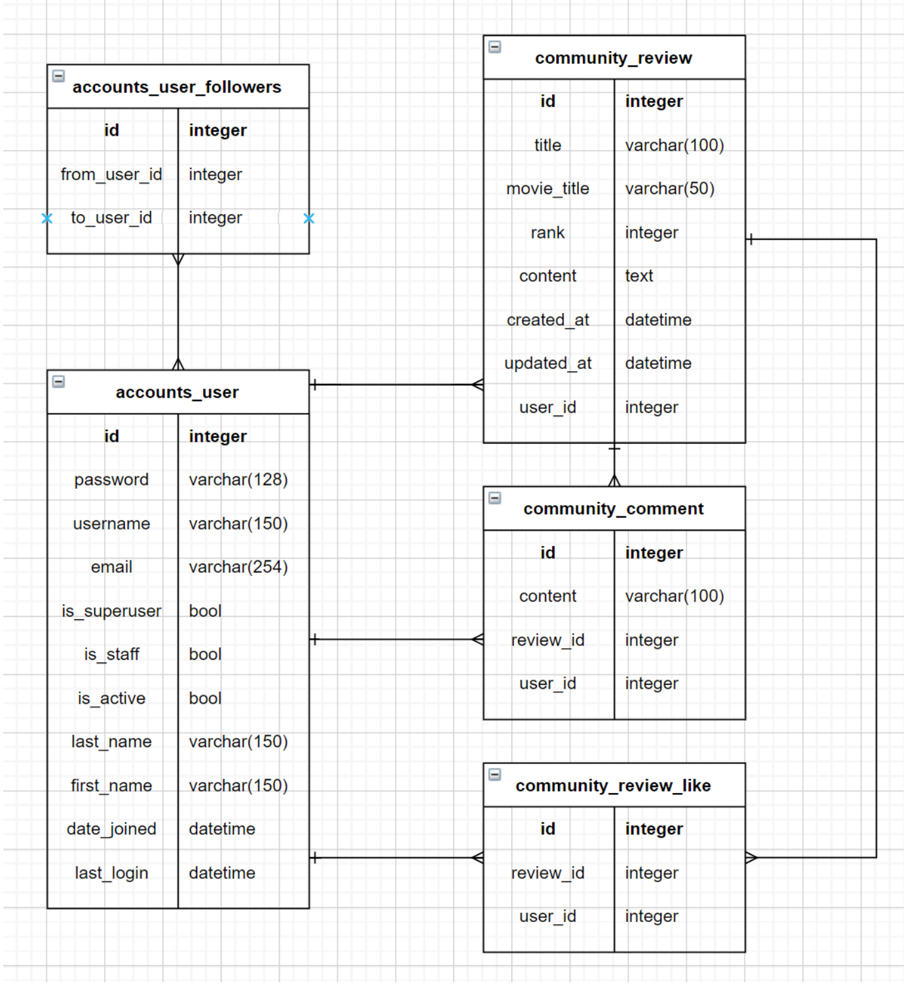

https://user-images.githubusercontent.com/78768769/138486904-dabee15c-f424-4031-b6f7-1c8e1ca03b2e.mov

> python venv/bin/activate

> pip install -r requirements.txt

# 구현의도

- 이전 설계(CRUD) 로직을 바탕으로 추가 기능을 구현하였다.
- 서비스를 구현하기 전 필요한 데이터를 사전에 파악하고 관계를 파악하고자 하였다.
- ERD(Entity-Relationship Diagram) 개체-관계 모델을 그려서 작업 중 model 변경을 최소화하였다.
- 개발 순서에 있어서, 사용자가 이용하는 순서대로 개발하였다.
  - 1. 회원가입 
    2. 로그인
    3. 게시물 작성 및 확인
    4. 댓글 작성 및 확인
    5. 게시물에 좋아요
    6. 이용자 팔로우
- 또한 각 단계별로 구현할 때 장고에서 권장하는 실행 순서를 지키려고 하였다.
  - 1. 데이터 스키마를 기반으로 모델 제작
    2. 모델을 기반으로 모델폼을 제작
    3. GET 요청에 대한 페이지를 생성 : URL, View, Template 작성
    4. POST 요청에 대한 저장 로직 실행

# 프로젝트 개요

영화 커뮤니티 서비스 기능을 웹으로 개발하는 프로젝트이다. 모델 간 관계를 설정한 후 데이터를 CRUD 조작할 수 있는 기능을 구현하였다. Django web framework 를 사용하였으며 장고 Authentication 을 적용하였다. Database 의 1:N, M:N 관계를 이해하고 데이터 관계를 설정하였다.

데이터베이스에 대해 기본적인 사항만 배우고 바로 ERD를 그리기 어려웠고, 모델관계를 파악하는데 오랜 시간이 걸렸다. 필요성과 중요성을 인지하고 있는 만큼 추가적인 공부가 필요할 것 같다. 

# ERM



# 이전 프로젝트와 동일 기능

### accounts app

- 신규 사용자 생성(회원가입)
- 기존 사용자 인증(로그인)
- 인증된 사용자 인증 해제(로그아웃)

### community app

- 신규 리뷰 생성
- 전체 리뷰 목록 조회
- 단일 리뷰 상세 조회

# 프로젝트 추가 & 신규 기능

### accounts app

- 사용자 프로필 페이지 
- 사용자 팔로우 추가 & 팔로우 취소
  - 사용자 프로필 페이지에 팔로워 수와 팔로잉 수 표시
  - 프로필 페이지에는 해당 프로필 페이지 사용자를 팔로우할 수 있는 버튼 표시
  - 인증(로그인)된 사용자만 다른 사용자를 팔로우할 수 있고, 사용자는 자기 자신을 팔로우 할 수 없다.(미구현)
  - 이미 팔로우 중인 경우 팔로우 취소 버튼 표시

### community app

- 댓글 생성
- 리뷰 좋아요
  - 단일 리뷰 상세 조회 페이지에 좋아요 버튼과 좋아요 갯수 표시(갯수 미구현)
  - 이미 좋아요 버튼을 누른 경우 취소 버튼 표시
  - 인증된 사용자만 리뷰에 좋아요 누를 수 있다

### 기타

- `include` 를 활용하여 html 분리
- 모델폼 필드 제한 `exclude`
- `ranks` 구현을 위한 `integerfield` 사용 
- 추가 django html
  - {{ review.get_rank_display }} : 별점 갯수 '별'로 출력
  - {{ review.created_at|naturaltime }} : 시간을 00분 전으로 변환(humanize)
  - {{ review.like_users.all|length }} : 게시물을 좋아한 사람 수 

# 신규기능 상세

- 커스텀 유저 모델 제작 : 1:N, N:M 관계 구현을 위해 장고의 default user 모델이 아닌 새로운 모델유저를 제작하였다. 이를 위해 `settings.py` 에 `AUTH_USER_MODEL` 을 `accounts.User` 로 지정하였다. 

```python
# settings.py
AUTH_USER_MODEL = 'accounts.User'
```

​		또한 User 모델을 새롭게 제작하였다.

```python
# accounts/models.py
class User(AbstractUser):
    date_joined = models.DateTimeField(auto_now=True)
    last_login = models.DateTimeField(auto_now_add=True)
    followings = models.ManyToManyField('self', related_name='followers', symmetrical=False)
```

- 커스텀 사용자 모델폼 제작 : 기존 장고 내장 `UserCreationForm` 의 상속을 받는 `CustomUserCreationForm` 클래스를 폼으로 제작하였다. `User` 를 모델로 삼으며, `fields` 로 기존 모델폼에 추가 정보를 받는다.

```python
# accounts/forms.py
class CustomUserCreationForm(UserCreationForm):
    class Meta:
        model = User
        fields = UserCreationForm.Meta.fields + ('last_name', 'first_name', 'email',)
```

- 위의 모델을 바탕으로 프로필 페이지 제작
- 위의 모델을 바탕으로 팔로우 기능 구현

```python
# accounts/views.py
def follow(request, pk):
    User = get_user_model()
    me = request.user
    you = get_object_or_404(User, pk=pk)
    if me in you.followers.all():
        me.followings.remove(you)
    else:
        me.followings.add(you)
    return redirect('accounts:profile', you.username)
```

- 리뷰 모델 제작시 `user` 와 `like_users`  컬럼 추가

```python
class Review(models.Model):
		...
    # 한 명의 사용자가 여러 개의 리뷰를 적을 수 있다. 1:N
    user = models.ForeignKey(settings.AUTH_USER_MODEL, on_delete=models.CASCADE)
    # 여러 명의 사용자가 여러 개의 리뷰에 좋아요를 누를 수 있다. M:N
    like_users = models.ManyToManyField(settings.AUTH_USER_MODEL, related_name='like_reviews')
```

- 댓글 모델 제작시 `user` 와 `review` 컬럼 추가

```python
class Comment(models.Model):
  	# 한 명의 유저가 여러 개의 댓글을 남길 수 있다. 1:N
    user = models.ForeignKey(settings.AUTH_USER_MODEL, on_delete=models.CASCADE)
    # 여러 개의 게시물에 여러 개의 댓글이 달릴 수 있다. M:N
    review = models.ForeignKey(Review, on_delete=models.CASCADE)
    content = CharField(max_length=100)
```


# 어려웠던 점

- model 제작시 default와 default가 아닌 요소 구분 (ex. 회원가입시 username, password 등은 자동으로 생성되므로 모델에 따로 만들지 않아도 된다.)

- 새로운 함수의 사용 : `get_user_model()` 

- 팔로우/팔로워 로직 : 현재 요청하는 사용자(request.user)가 해당 프로필페이지의 pk와 일치하는 User의 `followers` 목록에 있다면, 요청하는 사용자의 `followings`에서 `User` 의 목록을 지우고 반대라면 추가한다.

  ```python
  class User(AbstractUser):
  		...
      followings = models.ManyToManyField('self', related_name='followers', symmetrical=False)
      # related_name : 역참조시 이름 바꿈
  ```

- 댓글 달기 로직 : `CommentForm` 모델폼을 사용하는데, 저장된 comment는 일단 stop하고, 댓글을 쓴 사용자가 누구인지 받아서 넣는다.  왜? Comment 모델에 user와 review 열을 외래키로 만들었기 때문에 이 정보도 전달해주어야 한다.

```python
@require_POST
def create_comment(request, pk):
    form = CommentForm(request.POST)
    if form.is_valid():
      	# comment 저장을 하지 않고 user를 찾아서 넣는다.
        comment = form.save(commit=False)
        comment.user = request.user
        comment.review_id = pk
        comment.save()
        return redirect('community:detail', pk)
```

- 이때, `POST` 요청만 받으며 빈 폼은 리다이렉트하는 경로에 보여야 하고, 포스트 요청이 들어오면 위의 과정을 수행한다. 

```python
form = CommentForm() #=> detial view 
form = CommentForm(request.POST) #=> create_comment view
```

- 댓글달기 및 좋아요 url 경로

```python
# 특정 게시물의 / 댓글 / 생성하기
path('<int:pk>/comment/create/', views.create_comment, name='create_comment'),
# 특정 게시물에 / 좋아요 누르기
path('<int:pk>/likes/', views.likes, name='likes'),
```

# 마주쳤던 에러들

- follow() got an unexpected keyword argument 'username'
  -  typeerror : pk가 와야하는데 username들어옴

- 'User' object has no attribute 'followers'
  - 대부분 makemigrations 와 migrate를 업데이트하지 않음

# Form

- `Review` 및 `Comment` 모델의 경우 모델의 데이터를 검증, 저장하고 에러메세지를 출력하기 위해 장고 내장 ModelForm 을 사용하였다.
- `User` 모델의 경우 커스텀 ModelForm 을 사용하였다.
- `User` 모델의 인증(로그인, 로그아웃) 기능은 django 제공 Form 을 사용하였다.

# 향후 추가할 기능

- 인증(로그인)된 사용자만 다른 사용자를 팔로우할 수 있고, 사용자는 자기 자신을 팔로우 할 수 없다.
- 단일 리뷰 상세 조회 페이지에 좋아요 갯수 표시
- 프로필 이미지 추가(media)
- 회원가입시 `CustomUserCreationForm` 을 사용하는데, 이 때 fields를 불러오는데 `password` 란은 항상 맨 뒤에 일치해 있다. 따라서 순서를 바꿔주고 싶다.
- 다른 사람의 프로필로 바로 들어가서 팔로우하기 기능
- 영화 이미지 추가
- 홈 네비게이션 반응형 토글 추가


# 사용한 추가사이트

- 부트스트랩

https://getbootstrap.com/docs/4.0/components/navbar/

- 장고 부트스트랩 5

https://django-bootstrap-v5.readthedocs.io/en/latest/

- 장고 이미지키트

https://github.com/matthewwithanm/django-imagekit

- 장고 시드 - 가라데이터 넣기

https://github.com/Brobin/django-seed

- 장고 디버그 툴바 - 반복작업 줄인다. 최적화 통해 쿼리셋 설정. 디벨롭.

https://django-debug-toolbar.readthedocs.io/en/latest/

- 시간데이터 ~분 전으로 바꾸기

https://docs.djangoproject.com/en/3.2/ref/contrib/humanize/


